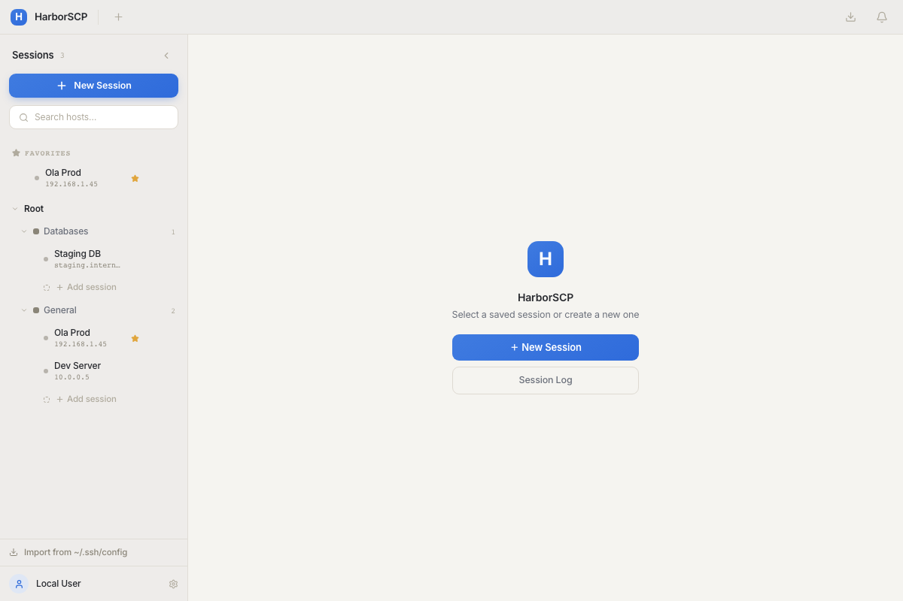
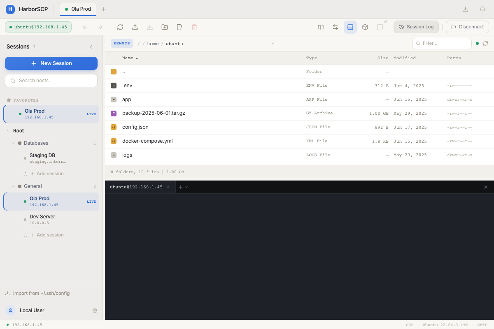
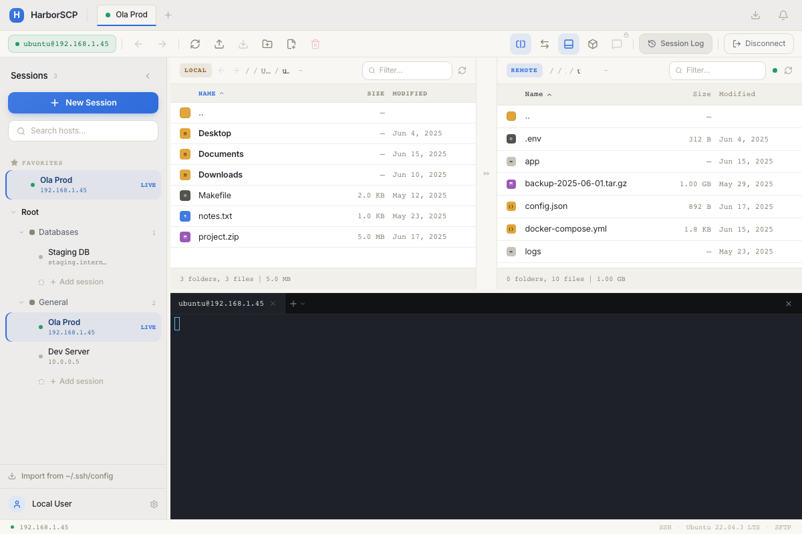
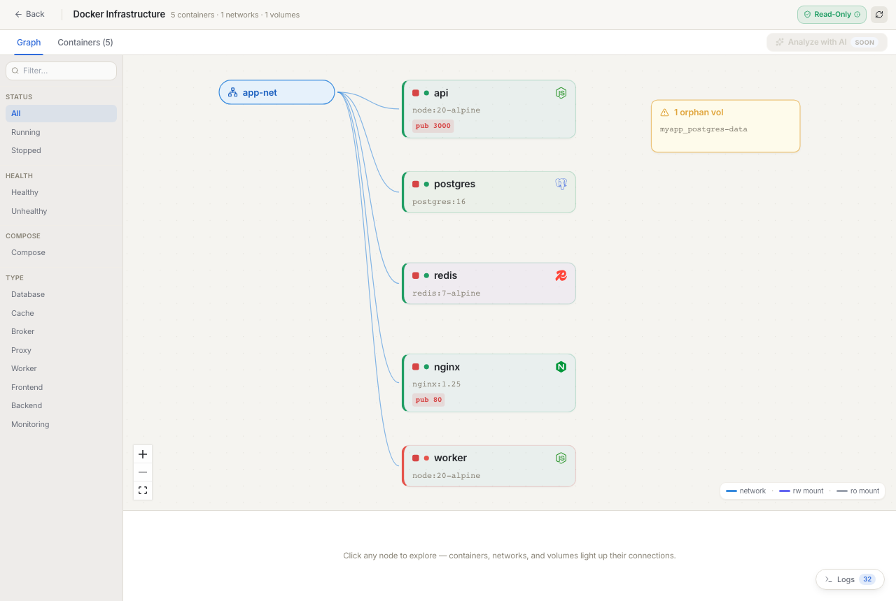
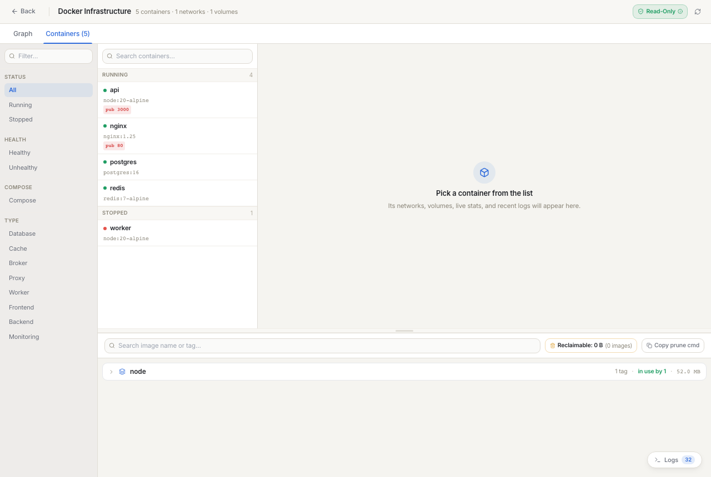
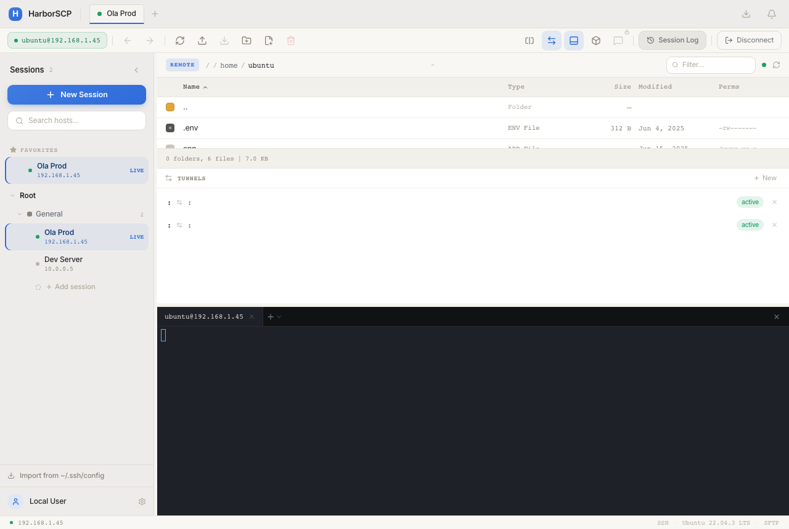

# HarborSCP

> Connect to any server, browse files, run commands, and inspect Docker infrastructure — all from one native desktop app.

---

## Download

| | |
|---|---|
|  | `HarborSCP_*_aarch64.dmg` |
|  | `HarborSCP_*_x64.dmg` |
|  | `HarborSCP_*_universal.dmg` |
|  | `HarborSCP_*_x64-setup.exe` or `.msi` · or portable `HarborSCP_*_x64_portable.zip` |

[Build from source →](CONTRIBUTING.md)

---

## What you can do

### Save and connect to servers

Save your servers once — SSH key or password, organized into folders. Connect in one click.
Import your existing `~/.ssh/config` entries automatically so you never retype a host.

---

### Browse and manage files

Navigate your remote filesystem exactly like a local file manager.
Create folders, rename files, delete items, change permissions (chmod) — no terminal needed.
Click any file to preview its contents without downloading it first.

---

### Transfer files with drag-and-drop

Switch to dual-pane mode to see local and remote side-by-side.
Drag files across to upload or download. Watch real-time progress and cancel any transfer mid-flight.

---

### Run a real terminal

Full shell — right inside the app. Every command is logged with its timestamp, exit code, and duration.
Open the Session Log any time to replay everything that ran in your session.

---

### Explore your Docker infrastructure

See all containers, images, networks, and volumes laid out as a visual graph.
Understand what's connected to what at a glance.

Click any container for live CPU and memory stats, recent logs, mount details, and image metadata.
Start, stop, or inspect containers without leaving the app.

---

### Forward ports in two clicks

Tunnel any remote service to your local machine. Built-in presets for PostgreSQL, MySQL, Redis, and HTTP.
Multiple tunnels run simultaneously — see all active forwards at once.

---

## Quick start

1. Download for your platform above
2. Click **+ New Session**, enter host + username
3. Choose password or SSH key, click **Connect**
4. Your files appear immediately — terminal and Docker panels are one click away

---

Tech stack

| Layer | Technology |
|---|---|
| App framework | [Tauri 2](https://tauri.app) — native desktop, ~10 MB bundle, no Electron |
| Backend | Rust — SSH/SFTP session handling, file ops, port forwarding |
| SSH library | [`ssh2`](https://crates.io/crates/ssh2) crate (libssh2 bindings) |
| Frontend | React 19 + TypeScript |
| Terminal | [xterm.js](https://xtermjs.org) with shell integration hooks |
| Database | SQLite (via `rusqlite`) — local session log, saved servers |
| Styling | Tailwind CSS |

The Rust backend opens the SSH/SFTP session directly and exposes commands to the React frontend via Tauri's IPC bridge. No hosted server, no credentials leaving your machine.

---

## Contributing

Contributions are welcome. Read [CONTRIBUTING.md](CONTRIBUTING.md) for build instructions, code style, and how to submit a pull request.

For bugs and feature requests, open a [GitHub Issue](https://github.com/AvinashNath2/harbor-ssh-client/issues).

---

MIT License · Copyright 2025 [Avinash Nath](https://github.com/AvinashNath2)
